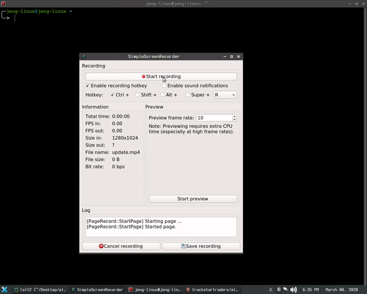

<h1>

alt2

</h1>

- A script / program created using Python via web scraping using  _**Requests module and BeautifulSoup**_. 

- This program can be use to identify alternative software for Linux. 

- This is a webscrape program via alternativeto website. 

- Kudos to that site very informative

 
 
 

 ### Install Instruction: 

1. Clone this repo. 
    #### `git clone https://github.com/rockstartraders/alt2`

   If git is not installed just download it then extract it to your pc.

         

 

 
 2. After cloning go to the directory.

      #### `cd to alt2 directory and Run the ./Install script also make sure to install Python3, PIP3, subversion etc.(see text via ./Install script).`

          

 
 

3. After Install just run alt2.

             

    

 

  4. If in case update is available.

      #### `See image below`

       

 

5. Just update it by going to the root path.  
      #### `Path; /alt2`
       If permission error occurs you know the drill.

    ## [Sudo](https://en.wikipedia.org/wiki/Sudo)    is the key.

       

      

