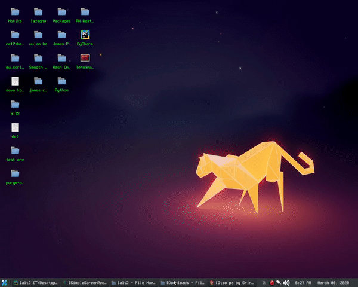

<h1>

alt2

</h1>

- A script / program created using Python3 via web scraping using  _**Requests module and BeautifulSoup**_. 

- This program can be use to identify alternative software for Linux. 

- This is a webscrape program via alternativeto website. 

- Kudos to that site, it is very informative.

- Special Thanks to  [PyMoondra's](https://www.youtube.com/channel/UC0bkqrWNBKxGZi-4gIfaCpg)   Tutorial on how to make web scraping easy (please see link to his YT Channel).

 
 

 # Install Instruction: 

 There are two 2 ways to run this program, First is the old fashion way wherein you need to clone this repo then install the requirements.txt then run the main script which is :

 #### `Python3 ./alt2.py`
 or
 #### `You can set the $PATH and set an alias.`

  
  
 
Then just remove the unnecessary files such as: 
 #### `Install.sh , alt2_.py, change_log.txt, version.txt, img directory. (Just keep the parser.sh in case update is needed). `

 
 
 

 Another way is to install it to your machine via the process below :
 
 #### `The benefit of doing this is that you will be getting a notification if in case update is needed / available.`
 

 

1. Clone this repo. 
    #### `git clone https://github.com/rockstartraders/alt2`

   If git is not installed just download it then extract it to your pc.

         

 

 
 2. After cloning go to the directory.

      #### `cd to alt2 directory and Run the ./Install script.`

       #### `But before doing that please make sure to installPython3, PIP3, subversion and curl.`
          

          

   #### `(see text via ./Install script)`

 

3. After Install just run alt2 and type the name of the application.

    #### `If alt2 command failed to work just close and relaunch a new terminal session and try it again.`

             

    

 

  4. If in case update is available.

       #### See image below:

       

 

5. Just update it by going to the root path and run the parser.sh with sudo priviledge.  
      #### `Path: /alt2`
      
       If permission error occurs you know the drill.

    #### [Sudo](https://en.wikipedia.org/wiki/Sudo)    is the key or check permission via chmod.

       

      

